# Heart Disease Risk Prediction Using Decision Tree-Based Healthcare Analytics

[](https://www.python.org/)
[](https://streamlit.io/)
[](https://scikit-learn.org/)
[-2ba02b?style=for-the-badge)](https://scikit-learn.org/stable/modules/tree.html)
[](https://pytest.org/)
[](LICENSE)
[-informational?style=for-the-badge)](https://archive.ics.uci.edu/dataset/45/heart+disease)

An academic machine-learning and healthcare analytics system to predict heart disease risk based on clinical features from the Cleveland Heart Disease dataset.

---

## 1. Project Overview & Interactive Application Preview

This project implements an end-to-end healthcare analytics and machine-learning pipeline:
* **Exploratory Data Analysis (EDA):** Demographic, symptomatic, physiological, and fluoroscopic cardiac markers.
* **Explainable Machine Learning:** Decision Tree classification as the central, white-box model.
* **Comparative Model Benchmarking:** Logistic Regression, Random Forest, and K-Nearest Neighbors baselines.
* **Controlled Hyperparameter Tuning:** `GridSearchCV` strictly isolated within 5-fold training cross-validation.
* **Reusable Risk Prediction Pipeline:** Clinical schema sanity checks and risk stratification.
* **Interactive Risk Prediction Dashboard:** Streamlit multi-page web application.

### Application Dashboard Preview:

| Home Dashboard View | Interactive Risk Assessment Output |
| :---: | :---: |
| 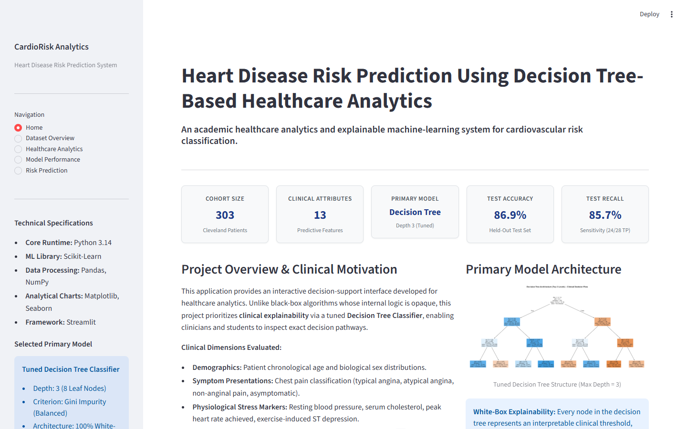 | 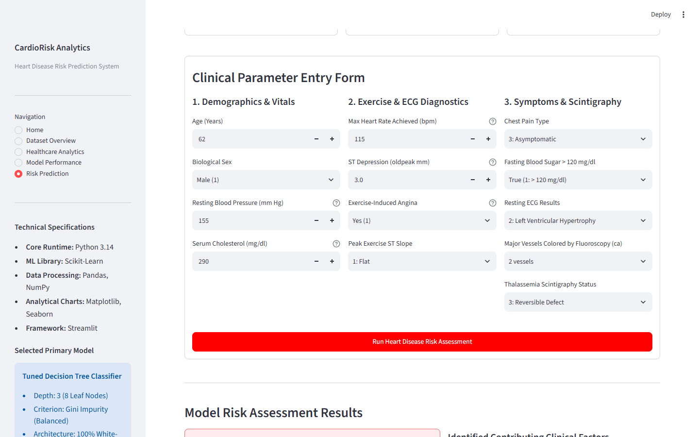 |

---

## 2. Dataset Attribution & Clinical Provenance

* **Source:** [UCI Machine Learning Repository — Heart Disease Dataset](https://archive.ics.uci.edu/dataset/45/heart+disease)
* **Clinical Origin:** Cleveland Clinic Foundation (Dr. Robert Detrano et al.).
* **Cohort Size:** 303 patient records, 13 predictive clinical features, 1 binary target variable.
* **Target Representation:** `0 = No Heart Disease (54.13%)`, `1 = Heart Disease Present (45.87%)`.

---

## 3. Project Structure

```text
heart-disease-risk-classifier/
│
├── data/
│   ├── raw/
│   │   └── Heart_disease.csv             # Immutable Cleveland dataset (303 records)
│   └── processed/
│       └── heart_disease_processed.csv   # Validated, leakage-free dataset (303 records)
│
├── notebooks/
│   └── exploratory_analysis.ipynb        # Reproducible 13-section EDA notebook
│
├── src/
│   ├── __init__.py
│   ├── data_preprocessing.py             # Preprocessing & schema validation module
│   ├── exploratory_analysis.py           # Statistical profiling & figure generation module
│   ├── train_model.py                    # ML model pipelines, CV & tuning routines
│   ├── evaluate_model.py                 # Metric calculations, confusion matrices & tree plots
│   └── prediction.py                     # Inference pipeline & input validation engine
│
├── models/
│   ├── final_model_pipeline.pkl          # Serialized complete final model pipeline
│   ├── final_model_pipeline.joblib
│   ├── decision_tree_model.joblib
│   ├── logistic_regression_model.joblib
│   ├── random_forest_model.joblib
│   ├── knn_model.joblib
│   └── model_metadata.json               # Schema, hyperparameters, and test metrics
│
├── app/
│   └── app.py                            # Multi-page Streamlit analytics & prediction dashboard
│
├── reports/
│   ├── figures/                          # 25 analytical and ML evaluation charts
│   │   ├── final_confusion_matrix.png
│   │   ├── final_roc_curve.png
│   │   ├── final_decision_tree.png
│   │   ├── final_feature_importance.png
│   │   ├── model_performance_comparison.png
│   │   ├── correlation_heatmap.png
│   │   └── ...
│   └── results/
│       ├── data_quality_report.json
│       ├── model_comparison.csv
│       ├── cross_validation_results.csv
│       ├── final_model_selection.json
│       └── final_feature_importance.csv
│
├── screenshots/                          # Real Streamlit application screenshots
│   ├── 01_home_dashboard.png
│   ├── 02_dataset_overview.png
│   ├── 03_healthcare_analytics.png
│   ├── 04_model_performance.png
│   ├── 05_risk_prediction_input.png
│   └── 06_risk_prediction_result.png
│
├── tests/
│   ├── test_app.py                       # 5 unit tests for dashboard accessors & figures
│   ├── test_data_preprocessing.py        # 10 unit tests for data cleaning & validation
│   ├── test_exploratory_analysis.py      # 4 unit tests for EDA & statistics
│   ├── test_model_training.py            # 4 unit tests for model training & CV
│   ├── test_model_evaluation.py          # 3 unit tests for metrics & tree plotting
│   └── test_prediction.py                # 11 unit tests for prediction, bounds & repeatability
│
├── requirements.txt                      # Clean, minimal dependencies
├── pytest.ini                            # Pythonpath & testpaths configuration
├── conftest.py                           # Headless Matplotlib Agg configuration
├── README.md                             # Comprehensive project documentation
├── LICENSE                               # MIT License
└── .gitignore                            # Cache & environment exclusion rules
```

---

## 4. Data Preprocessing & Quality Pipeline (Phase 2)

The data preprocessing module (`src/data_preprocessing.py`) handles:
1. **Raw Data Preservation:** The raw dataset in `data/raw/` is treated as immutable and never modified.
2. **Encoding & BOM Handling:** Handles UTF-8 BOM (`utf-8-sig`) without column corruption.
3. **Schema Validation:** Strict verification of all 13 clinical features and the target variable.
4. **Data Hygiene:** Explicit checks for duplicate rows and sentinel missing-value tokens (`?`, `NA`, `null`).
5. **Target Standardisation:** Validates binary classification representation ($0 = \text{No Heart Disease}$, $1 = \text{Heart Disease Present}$).
6. **Leakage Prevention:** Strict feature/target separation ($X$ and $y$) with assertions ensuring zero target leakage. Downstream scalers and encoders are fitted solely on training splits.
7. **Automated Data Quality Reporting:** Generates structured JSON reports saved to `reports/results/data_quality_report.json`.

---

## 5. Exploratory Data Analysis & Healthcare Analytics (Phase 3)

The exploratory analysis module (`src/exploratory_analysis.py`) and notebook (`notebooks/exploratory_analysis.ipynb`) provide publication-quality visualizations across all 303 patient records:

### Key Empirical Findings & Figures:

| Target Class Distribution | Linear Feature Correlation Matrix |
| :---: | :---: |
| 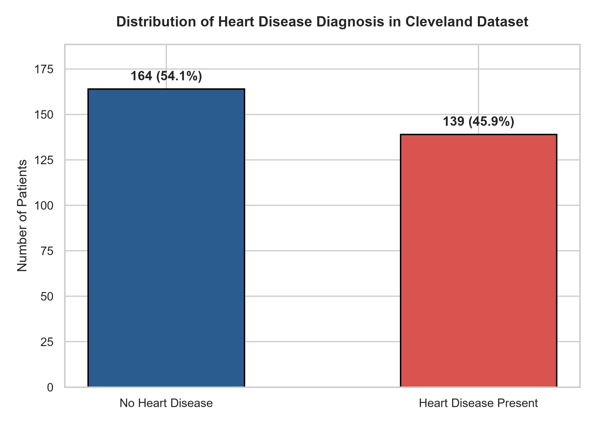 | 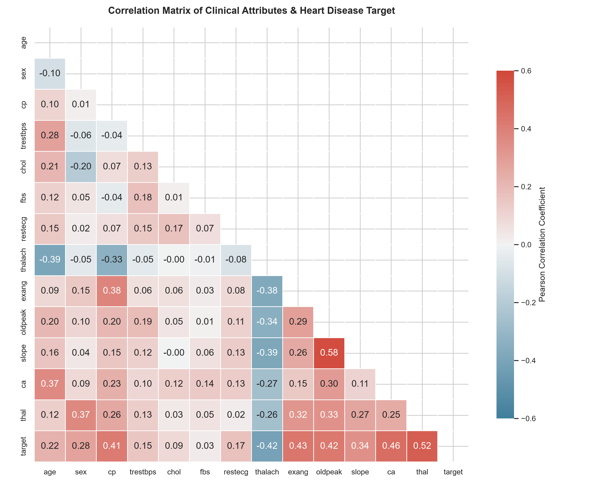 |

* **Cohort & Balance:** 164 patients (54.13%) without heart disease; 139 patients (45.87%) with heart disease.
* **Demographics:** Heart disease patients are older (mean $56.63 \pm 7.94$ vs $52.59 \pm 9.51$ years). Males exhibited a 55.34% disease rate (114/206) compared to 25.77% in females (25/97) in this clinical referral cohort.

| Chest Pain Presentation vs Diagnosis | Age Distribution by Diagnostic Class |
| :---: | :---: |
| 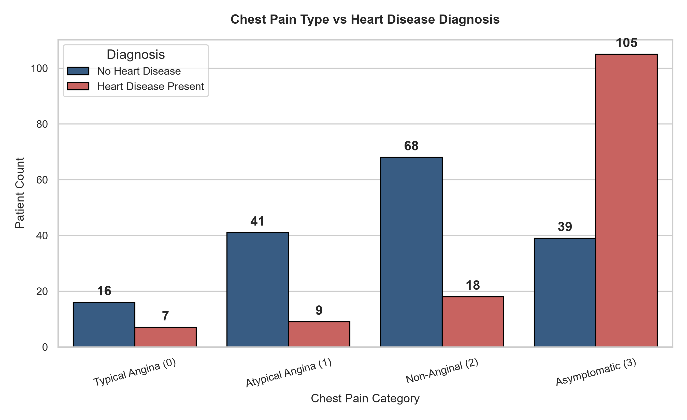 | 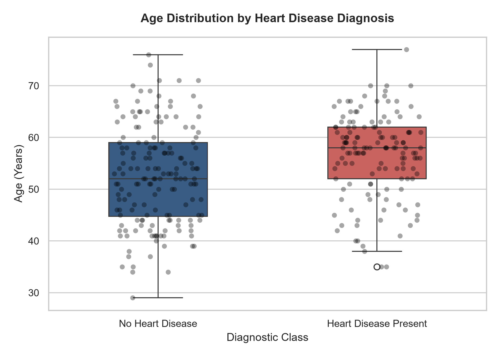 |

* **Chest Pain Types (`cp`):** Asymptomatic presentations (`cp=3`) had the highest disease rate at **72.92%** (105/144), whereas non-anginal (`cp=2`, 20.93%) and atypical angina (`cp=1`, 18.00%) had significantly lower rates.

| Exercise ST Depression (`oldpeak`) | Fluoroscopic Major Vessels (`ca`) |
| :---: | :---: |
| 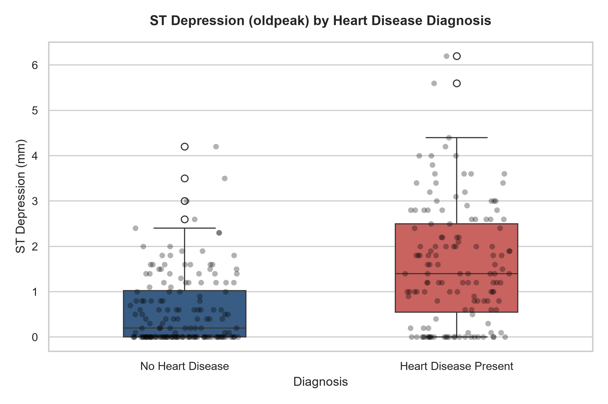 | 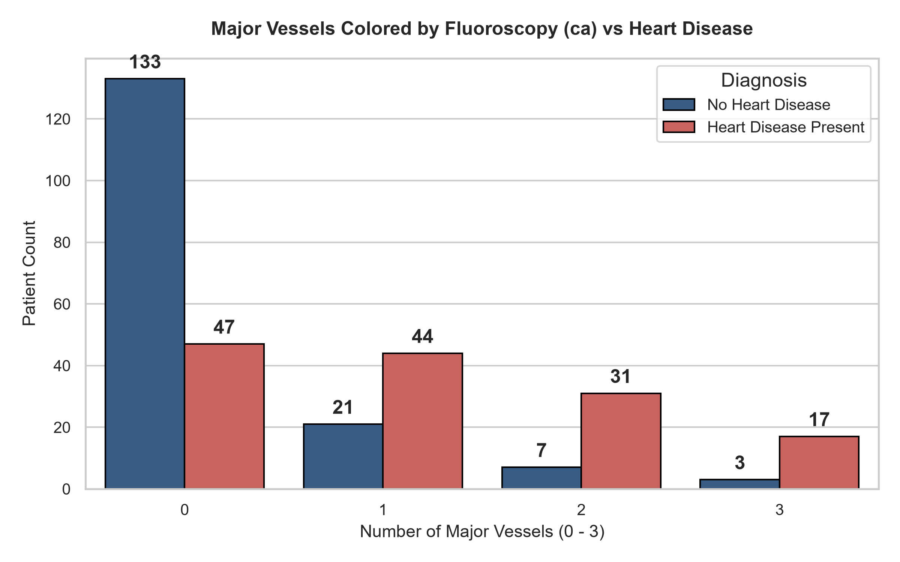 |

* **Exercise Stress & Imaging Markers:**
  - **Peak Heart Rate (`thalach`):** Inversely correlated ($r = -0.417$); disease cohort achieved lower mean peak heart rate ($139.26$ bpm vs $158.38$ bpm).
  - **Exercise Angina (`exang`):** Positively correlated ($r = 0.432$); 76.77% disease prevalence when exercise angina is present.
  - **ST Depression (`oldpeak`):** Positively correlated ($r = 0.425$); mean depression of $1.57$ mm in disease vs $0.59$ mm in non-disease.
  - **Major Vessels (`ca`):** Escalating disease rate from 26.11% ($ca=0$) to 85.00% ($ca=3$) ($r = 0.460$).
  - **Thalassemia (`thal`):** Reversible defect status (`thal=3`) had a 76.07% heart disease rate ($r = 0.516$).

---

## 6. Machine Learning Baseline Benchmarking (Phase 4)

Four classification architectures were evaluated on an untouched 20% test split ($N=61$) after 5-Fold Stratified Cross-Validation on the 80% training split ($N=242$):

| Model | Test Accuracy | Test Precision | Test Recall (Sensitivity) | Test F1-Score | Test ROC-AUC | 5-Fold CV Accuracy |
| :--- | :---: | :---: | :---: | :---: | :---: | :---: |
| **Logistic Regression** | **0.8852** | 0.8387 | **0.9286** | **0.8814** | **0.9665** | $0.8471 \pm 0.0100$ |
| **KNN ($k=5$)** | **0.8852** | **0.8621** | 0.8929 | 0.8772 | 0.9529 | $0.8222 \pm 0.0288$ |
| **Random Forest** | 0.8525 | 0.8065 | 0.8929 | 0.8475 | 0.9567 | $0.8096 \pm 0.0321$ |
| **Decision Tree (Baseline)** | 0.7869 | 0.7586 | 0.7857 | 0.7719 | 0.8755 | $0.7357 \pm 0.0342$ |

### Model Benchmark Comparison Chart:
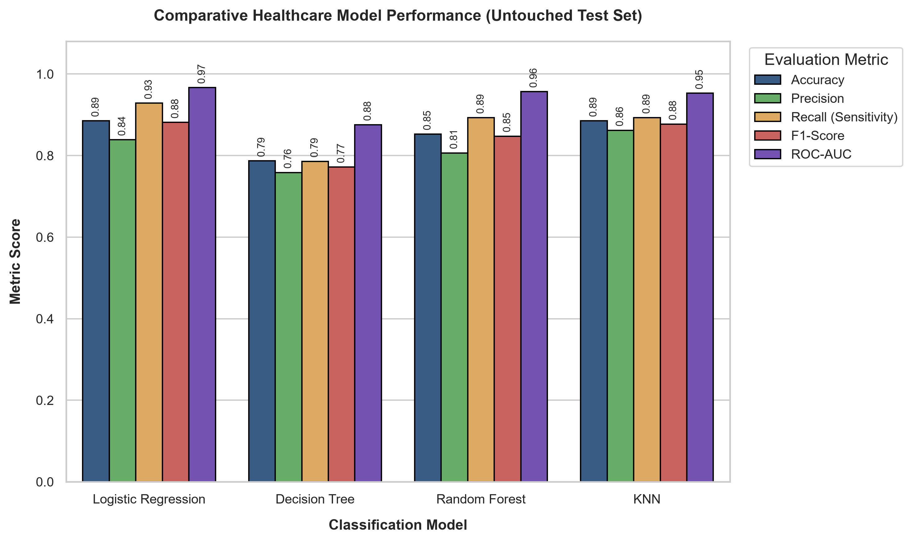

---

## 7. Model Selection & Hyperparameter Tuning (Phase 5)

### Hyperparameter Tuning Methodology:
To optimize the primary Decision Tree for clinical screening sensitivity while preserving white-box interpretability, a controlled `GridSearchCV` was executed strictly on the 242-sample training set using 5-Fold Stratified Cross-Validation across:
* `criterion`: `['gini', 'entropy']`
* `max_depth`: `[3, 4, 5, 6, 8, None]`
* `min_samples_split`: `[2, 5, 10]`
* `min_samples_leaf`: `[1, 2, 4, 6, 8]`
* `class_weight`: `[None, 'balanced']`

### Optimal Selected Hyperparameters:
* `criterion`: `'gini'`
* `max_depth`: `3`
* `min_samples_leaf`: `1`
* `min_samples_split`: `2`
* `class_weight`: `'balanced'`

### Baseline Decision Tree vs. Tuned Decision Tree (Held-Out Test Split):

| Evaluation Metric | Baseline Decision Tree (`depth=4`) | Tuned Decision Tree (`depth=3, balanced`) | Clinical Impact |
| :--- | :---: | :---: | :--- |
| **Accuracy** | 0.7869 | **0.8689** | $+8.20\%$ overall diagnostic classification accuracy |
| **Precision** | 0.7586 | **0.8571** | $+9.85\%$ precision (fewer false alarms) |
| **Recall (Sensitivity)** | 0.7857 | **0.8571** | $+7.14\%$ disease detection ($24/28$ cardiac patients detected) |
| **F1-Score** | 0.7719 | **0.8571** | $+8.52\%$ balanced F1 score |
| **ROC-AUC** | 0.8755 | **0.8712** | Stable discriminative power |
| **Tree Complexity** | 16 leaves, depth 4 | **8 leaves, depth 3** | Simpler, more robust, highly interpretable decision rules |

### Final Diagnostic Figures:

| Final Test Confusion Matrix | Final Test ROC Curve |
| :---: | :---: |
| 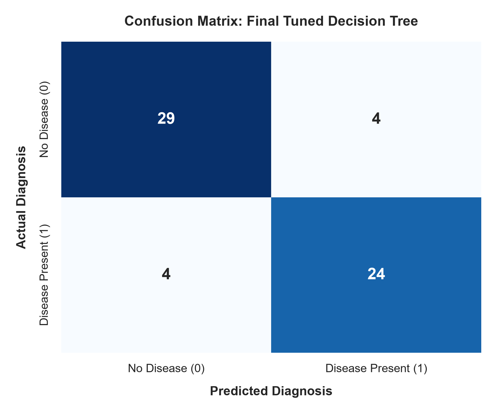 | 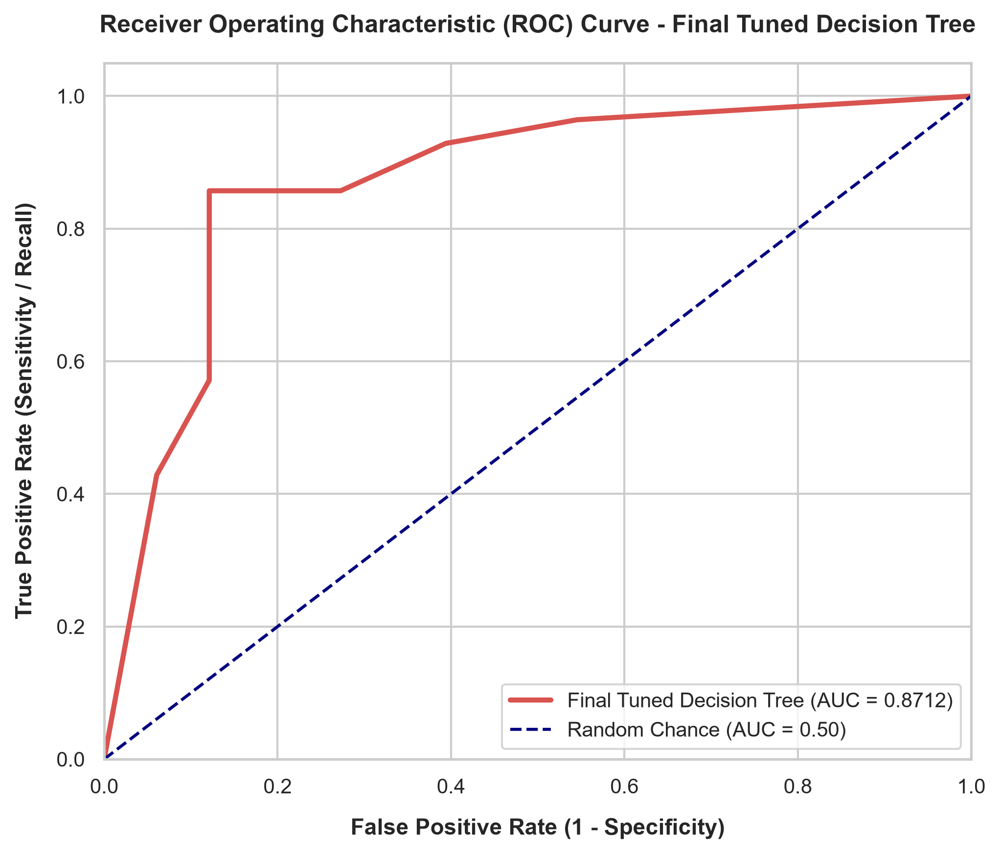 |

| Final Decision Tree Structure (Depth 3) | Gini Feature Importance Ranking |
| :---: | :---: |
| 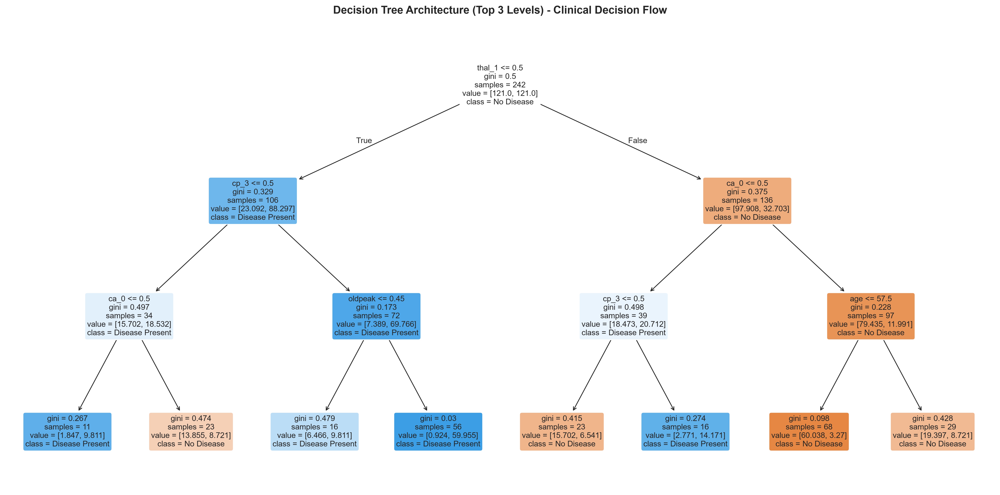 | 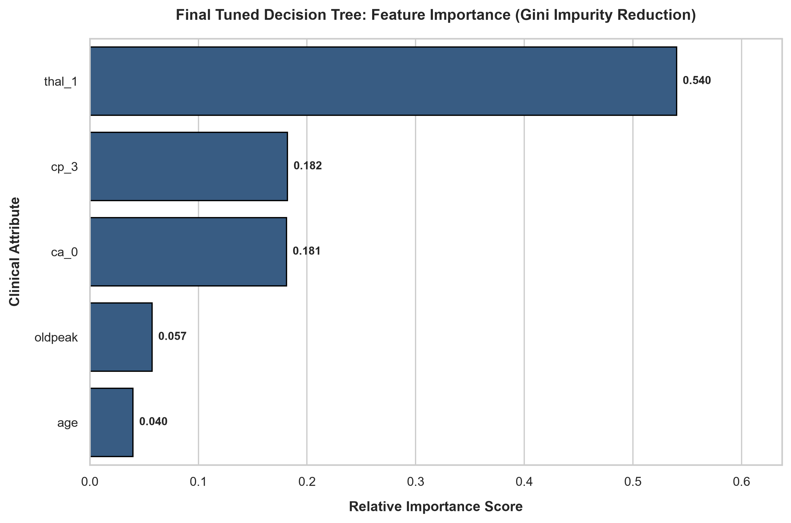 |

### Top Predictive Features (Tuned Decision Tree):
1. `thal_1` (Normal Thalassemia Status): **54.01%**
2. `cp_3` (Asymptomatic Chest Pain): **18.18%**
3. `ca_0` (Zero Fluoroscopy Major Vessels): **18.10%**
4. `oldpeak` (ST Depression): **5.73%**
5. `age`: **3.97%**

---

## 8. Prediction Pipeline & Input Validation (Phase 5)

The inference pipeline in [`src/prediction.py`](file:///d:/Sem_Project/heart-disease-risk-classifier/src/prediction.py) provides:
* **Strict Clinical Input Validation:** Checks types, non-null values, categorical values, and sanity bounds.
* **Key Order Invariance:** Automatically reorders inputs to match training schema.
* **Risk Stratification:** Assigns categories ("Lower Predicted Risk" / "Higher Predicted Risk") and risk tiers (Low $<40\%$, Moderate $40\%-70\%$, High $\ge 70\%$).
* **Contributing Factor Extraction:** Pinpoints key physiological and symptomatic risk indicators.
* **Mandatory Medical Disclaimer:** Enforces standard non-diagnostic academic disclaimer.

---

## 9. Project Limitations & Academic Healthcare Scope

For academic viva evaluation and healthcare context, the following limitations are documented:
1. **Sample Size:** The dataset contains 303 records from a single medical center (Cleveland Clinic Foundation).
2. **Referral Cohort Demographics:** The cohort contains a higher proportion of males (68%) and referred patients undergoing angiography, which may not reflect general population distributions.
3. **Historical Data:** The dataset was collected in the late 1980s; diagnostic thresholds and imaging techniques have evolved.
4. **Clinical Validation:** The model serves as an educational and decision-support risk screening tool; it has not undergone formal clinical trial or FDA/regulatory validation.

---

## 10. Running the Streamlit Healthcare Analytics Application

Launch the interactive dashboard with:

```bash
streamlit run app/app.py
```

### Application Pages & Visual Walkthrough:

#### 1. Home Dashboard (`screenshots/01_home_dashboard.png`)

*Dynamic key metrics (cohort size, features, test accuracy, recall), methodology overview, and decision tree architecture diagram.*

#### 2. Dataset Overview (`screenshots/02_dataset_overview.png`)
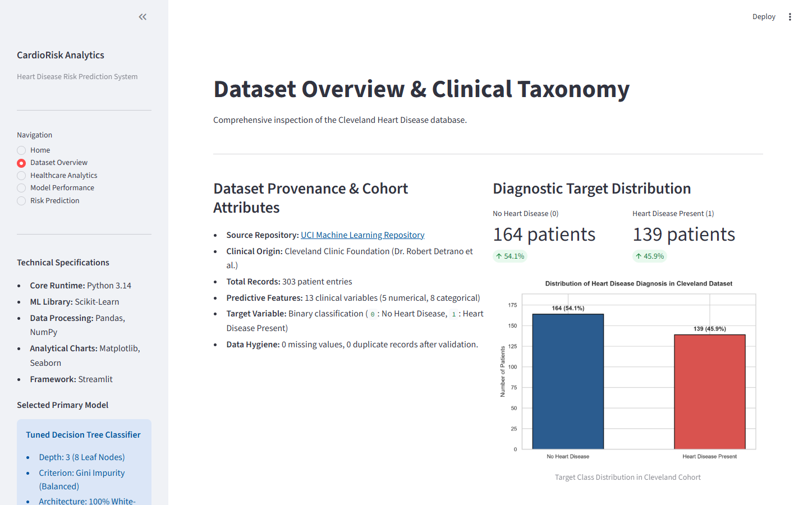
*Cleveland cohort provenance, target distribution metrics, 13-feature taxonomy table, and interactive dataset expander.*

#### 3. Healthcare Analytics (`screenshots/03_healthcare_analytics.png`)
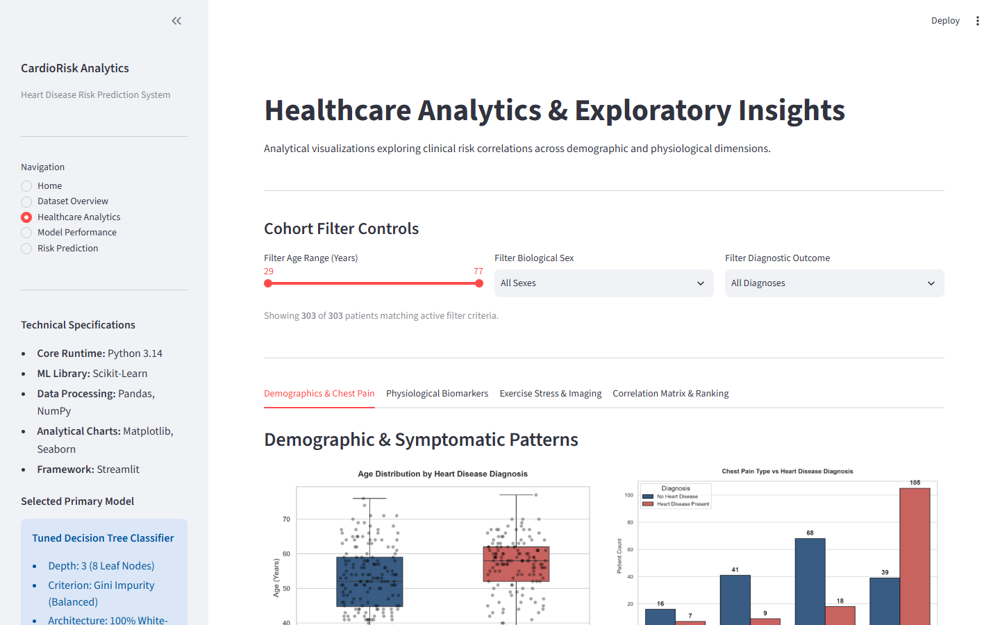
*Dynamic cohort filter controls (age range slider, sex, diagnosis) and 4 analysis tabs (Demographics, Biomarkers, Exercise Stress, Correlation Heatmap).*

#### 4. Model Performance (`screenshots/04_model_performance.png`)
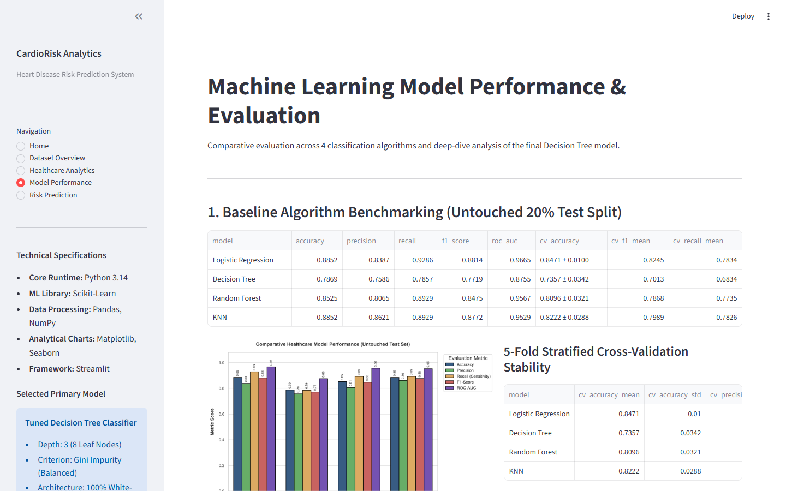
*4-model benchmark comparison table, 5-Fold Stratified CV stability analysis, baseline vs tuned table, confusion matrix, ROC curve, and feature importances.*

#### 5. Risk Prediction Input Form (`screenshots/05_risk_prediction_input.png`)
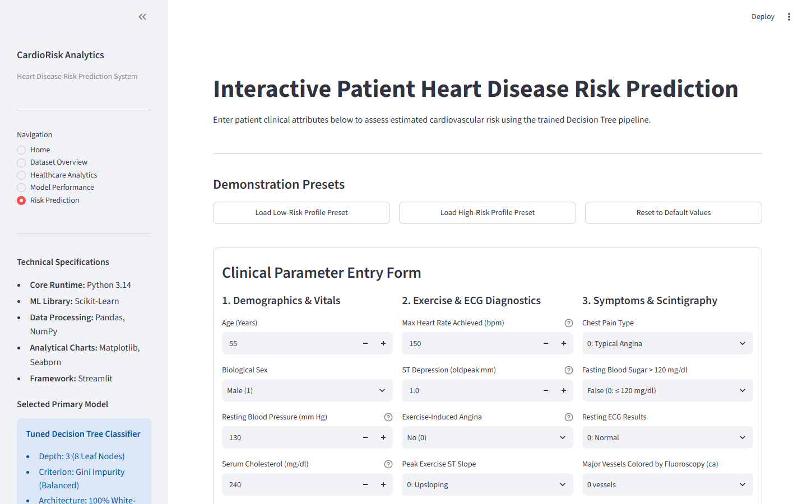
*Organized clinical parameter entry form (Demographics, Exercise diagnostics, Symptoms/Scintigraphy) with quick profile presets.*

#### 6. Risk Assessment Results (`screenshots/06_risk_prediction_result.png`)

*Real-time risk assessment badge ("Higher Predicted Risk" / "Lower Predicted Risk"), model probability progress bar, confidence score, contributing factors, and educational disclaimers.*

---

## 11. Installation & Complete Execution Guide

1. **Activate Virtual Environment:**
   ```bash
   # Windows:
   .\venv\Scripts\activate
   # Linux/macOS:
   source venv/bin/activate
   ```

2. **Install Dependencies:**
   ```bash
   pip install -r requirements.txt
   ```

3. **Execute Data Preprocessing Pipeline:**
   ```bash
   python -m src.data_preprocessing
   ```

4. **Generate Exploratory Analytics & Figures:**
   ```bash
   python -m src.exploratory_analysis
   ```

5. **Train, Tune, & Evaluate Machine Learning Models:**
   ```bash
   python -m src.train_model
   ```

6. **Run Automated Test Suite (37 unit tests):**
   ```bash
   pytest tests/ -v
   ```

7. **Launch Streamlit Dashboard:**
   ```bash
   streamlit run app/app.py
   ```

---

## 12. Medical Disclaimer

> **IMPORTANT:** This prediction system is generated by a machine-learning model for **educational and analytical purposes only**. It is **not a medical diagnosis** and must not be used as a substitute for professional medical advice, clinical evaluation, or treatment decisions.
